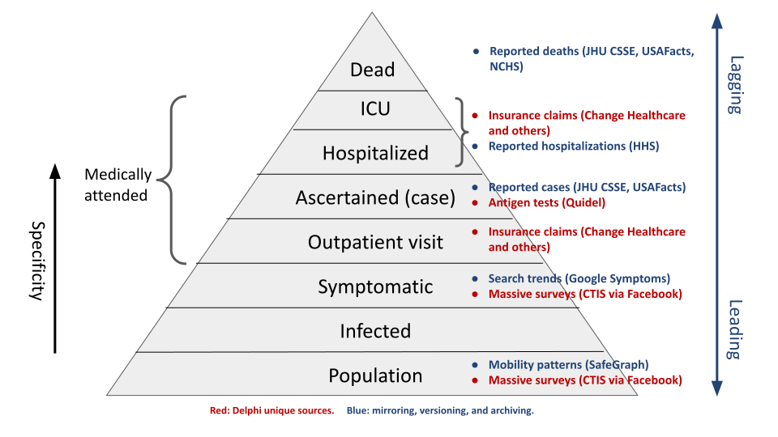

COVIDcast is the name for Delphi's project in support of the COVID-19 response
in the United States. It has several parts. 

1. We procure unique data streams that reflect COVID activity from a wide
  variety of sources, and extract COVID-related signals. These signals cover
  every nearly every rung of the [severity pyramid](#severity-pyramid), and
  constitute what we believe may be the nation's largest public repository of
  real-time, geographically-detailed indicators of COVID activity in the U.S.

2. We make all COVID-19 indicators freely available through a
  [public API](https://cmu-delphi.github.io/delphi-epidata/api/covidcast.html),
  which is updated with new data daily. We also provide associated
  [R](https://cmu-delphi.github.io/covidcast/covidcastR/) and
  [Python](https://cmu-delphi.github.io/covidcast/covidcast-py/html/) packages, 
  and a [dashboard]() to visualize a core set of
  indicators. 

3. Some of the underlying data sources (on which these indicators are built) 
  would not exist or be publicly available without Delphi's efforts. These
  include a massive national daily survey called the [COVID-19 Trends and
  Impact Survey (CTIS)]() that we're running in
  partnership with Facebook, which has been taken by over 25 million Americans
  since April 2020; and an enormous database of de-identified medical insurance
  claims, covering more than 35% of the U.S. population, made possible through
  health system partners including Change Healthcare. 

4. We support and advise the U.S. CDC (in collaboration with the
  [Reich Lab](https://reichlab.io/)) on short-term COVID forecasting, which 
  includes creating and evaluating an ensemble forecast out of the models
  submitted to the Forecast Hub, serving as the basis for the [CDC's official
  forecast communications](https://www.cdc.gov/coronavirus/2019-ncov/covid-data/forecasting-us.html). 

## See Also

- [COVIDcast dashboard]()
- [CTIS dashboard]()
- [Export data tool]()
- [API documentation](https://cmu-delphi.github.io/delphi-epidata/api/covidcast.html)
- [R package](https://cmu-delphi.github.io/covidcast/covidcastR/)
- [Python package](https://cmu-delphi.github.io/covidcast/covidcast-py/html/)
- [GitHub repo](https://www.github.com/cmu-delphi/covidcast/) (see also
  [related repos](https://github.com/cmu-delphi/covidcast/#related-repos))
  
## Articles

A summary of some key parts of COVIDcast can be found in the December 2021 PNAS
Special Feature: [Beyond cases and deaths: The benefits of auxiliary data
streams in tracking the COVID-19 pandemic](https://www.pnas.org/cc/beyond-cases-and-deaths).

- [Epidemic tracking and forecasting: Lessons learned from a tumultuous
  year](https://www.pnas.org/content/118/51/e2111456118?cct=2522)
  by Rosenfeld and Tibshirani
- [An open repository of real-time COVID-19
  indicators](https://www.pnas.org/content/118/51/e2111452118?cct=2522)
  by Reinhart et al.
- [Can auxiliary indicators improve COVID-19
  forecasting?](https://www.pnas.org/content/118/51/e2111453118?cct=2522)
  by McDonald et al.
- [Continuous real-time measurement of COVID-19 symptoms, risks, protective
  behaviors, testing, and vaccination](https://www.pnas.org/content/118/51/e2111454118?cct=2522)
  by Salomon et al.

More recent work on nowcasting using COVID-19 indicators:

- [Real-time estimation of COVID-19 infections via deconvolution and sensor
  fusion](https://arxiv.org/abs/2112.06697)
  by Jahja et al. 

## Severity Pyramid

